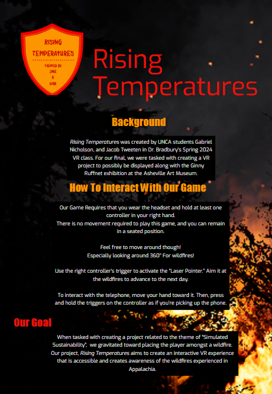

# Rising Temperatures
Developed with Unreal Engine 5

## Watch the Demo Video

# Background

Rising Temperatures was developed by UNCA students Gabriel Nicholson and Jacob Tweeten in Dr. Bradbury’s Spring 2024 VR class. This project was created as part of our final assignment, with the potential to be displayed alongside the Ginny Ruffner exhibition at the Asheville Art Museum.

When presented with the theme “Simulated Sustainability”, we were drawn to the idea of immersing players in the midst of a wildfire scenario. Rising Temperatures is designed to be an interactive VR experience that is both accessible and thought-provoking, raising awareness about the growing impact of wildfires in Appalachia.

👉 Learn more about the exhibition here: [Asheville Art Museum Exhibit](https://www.ashevilleart.org/event/virtual-reality-art-panel/)

# Note on Project Files
This repository does not contain the full project due to GitHub's 2GB file size limit. If you are interested in accessing the complete project files, please feel free to contact me at jacobrtweeten@gmail.com.

